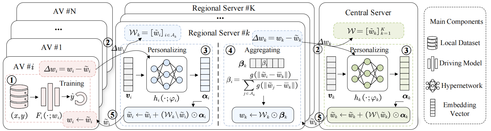

# FedRAV: Hierarchically Federated Region-Learning for Traffic Object Classification of Autonomous Vehicles

### Paper Overview

The emerging federated learning enables distributed autonomous vehicles to train equipped deep learning models collaboratively without exposing their raw data, providing great
potential for utilizing explosively growing autonomous driving
data. However, considering the complicated traffic environments
and driving scenarios, deploying federated learning for autonomous vehicles is inevitably challenged by non-independent
and identically distributed (Non-IID) data of vehicles, which
may lead to failed convergence and low training accuracy.
In this paper, we propose a novel hierarchically Federated
Region-learning framework of Autonomous Vehicles (FedRAV),
a two-stage framework,which adaptively divides a large area
containing vehicles into sub-regions based on the defined region-wise distance, and achieves personalized vehicular models and
regional models. This approach ensures that the personalized
vehicular model adopts the beneficial models while discarding
the unprofitable ones. We validate our FedRAV framework
against existing federated learning algorithms on three real-world autonomous driving datasets in various heterogeneous
settings. [Paper](https://arxiv.org/abs/2411.13979).

    

